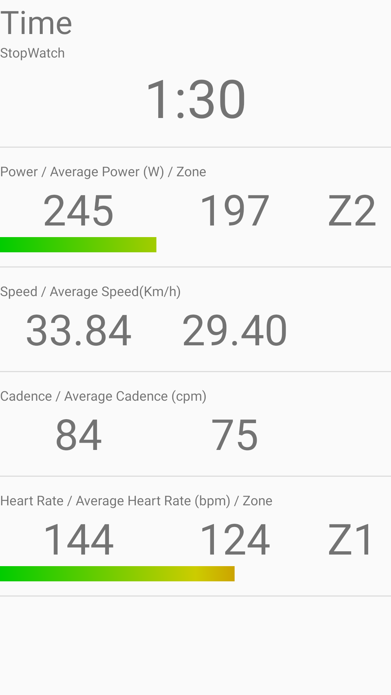
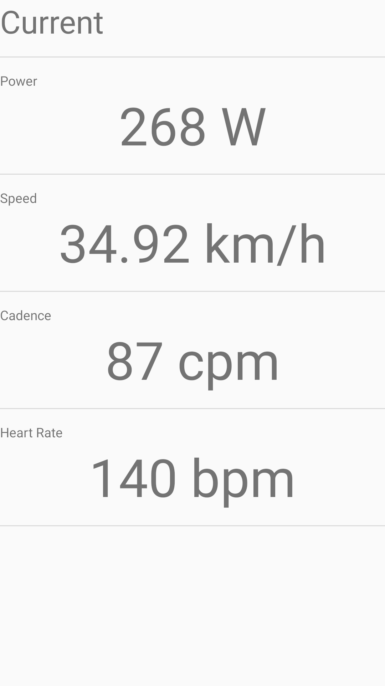
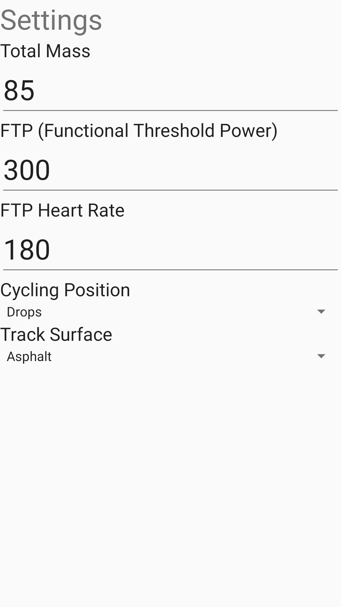
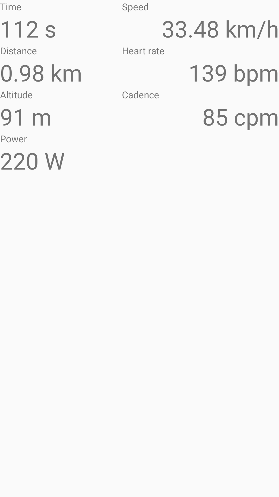

# Garmin Live Activity On Phone

This is NOT an application provided by Garmin.

This application retrieves live activity data from your Garmin devices and shows it on the screen.

## Requirements
- Garmin Connect is installed on your phone
- This application is installed on your phone
- PhoneActivity is installed on your Garmin device: [Github PhoneActivity](https://github.com/basva923/PhoneAcitvity)

## Documentation
To show your activity on your phone:
1. Connect your Garmin device to your phone.
2. Open the PhoneActivity app on your Garmin device.
3. Wait for a GPS signal (shown on top).
4. Open the GarminLive app on your phone.
5. Press start to begin your activity.

## Build instructions
The easiest way to contribute/build/try with the code is to import this project into android studio.

## Some screenshots

## Use Cases
- Use an old phone as a head unit on your bike, it you have a Garmin watch.

## Limitations
- The only activity type that is supported is Cycling.
