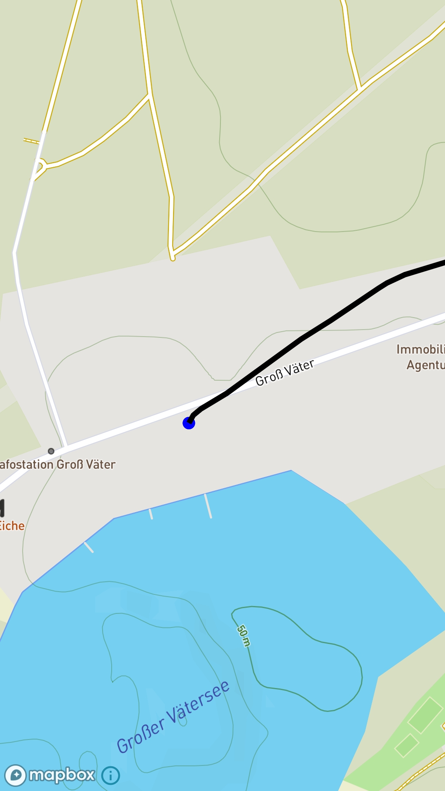

# Garmin Live Activity On Phone

This is NOT an application provided by Garmin.

This application shows live activity stats on your phone during a Ride.

Requirements:
- Garmin connect on phone
- Garmin device with connectiq
- Application installed on Garmin device
- Connection between phone and Garmin device

## Build instructions
The easiest way to contribute/build/try with the code is to import it into android studio.

## Some screenshots

